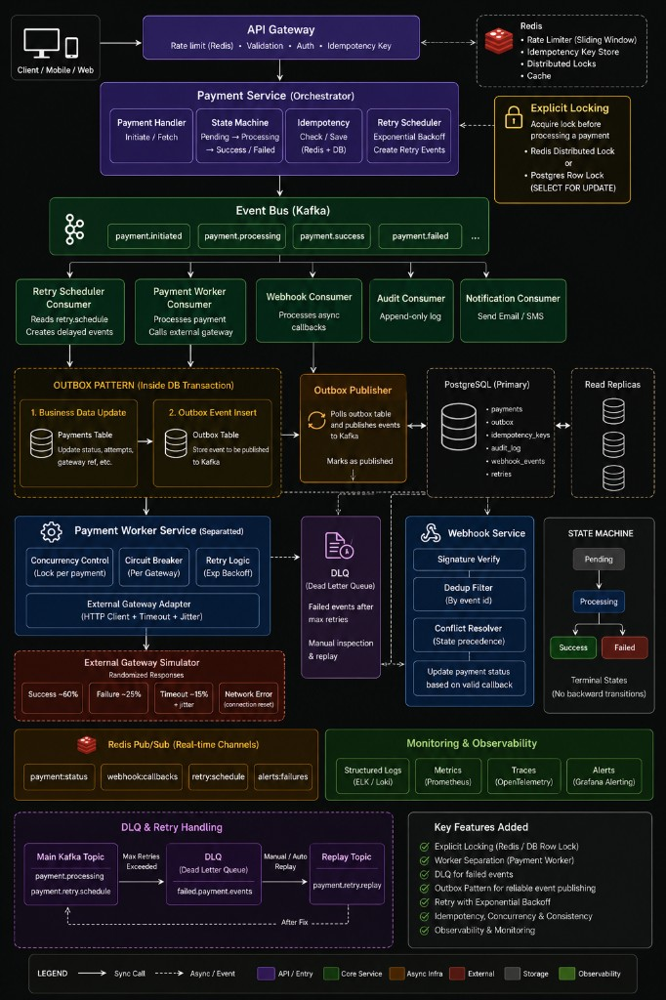
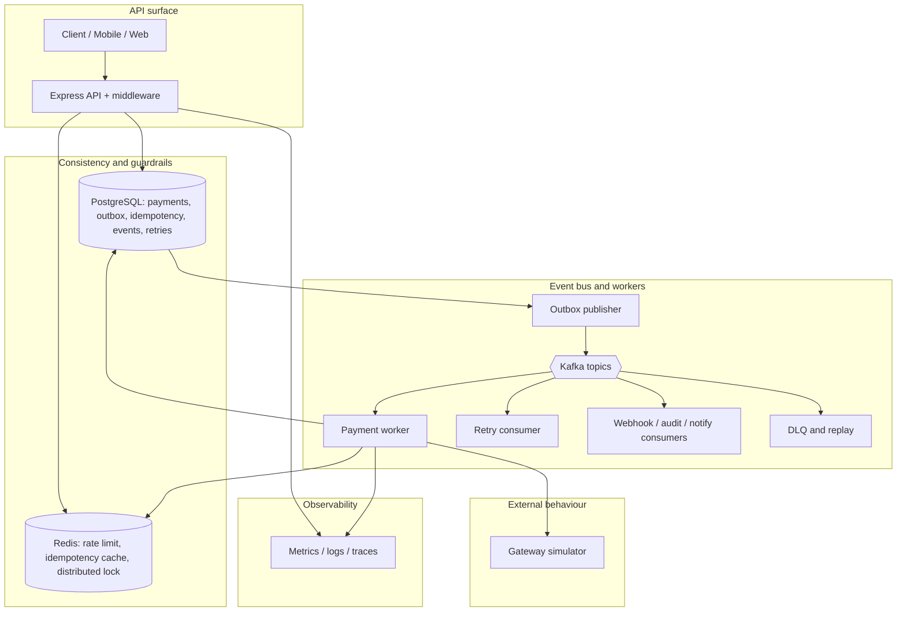

# Distributed payment processing (Node.js · TypeScript · Express)

Event-driven orchestration modeled after resilient payment backends: transactional **outbox**, **Kafka** fan-out, **Redis** caching/locks/rate limits, **PostgreSQL** (Prisma) as source of truth, dedicated **workers**, **DLQ + replay**, webhook reconciliation, Prometheus metrics and optional OTLP traces.

## Architecture

Reference diagram (distributed payment platform overview):



Simplified flow implemented in this repository:



**In brief**

- **Entry:** The HTTP API validates input, optional static **`API_TOKEN`**, **sliding-window rate limiting** (Redis), and **`Idempotency-Key`** (Redis cache + Postgres) before changing payment state.
- **Orchestration:** Payments follow a strict **state machine** (`PENDING` to `PROCESSING` to terminal `SUCCESS` or `FAILED`). **Transactional outbox** writes payment rows and outbox events in **one DB transaction** so Kafka outages never lose committed work.
- **Async processing:** The **outbox worker** publishes to **Kafka**. The **payment worker** consumes initiation events, acquires a **Redis lock** per payment, advances state, calls the **gateway simulator** (success / failure / timeout / jitter), and emits follow-up topics (success, failure, retry, **DLQ**). **Retries** use **exponential backoff**; a **replay** topic supports manual recovery after triage.
- **Webhooks:** **`x-payment-signature`** (HMAC-SHA256), **deduplication** by external event id, and **state precedence** keep provider callbacks safe when duplicated or out of order.
- **Observability:** **Correlation IDs**, structured **Pino** logs, **Prometheus** `/metrics`, and optional **OpenTelemetry** export support operations and capacity planning.

## Quick start with Docker Compose

Requires Docker Desktop (or Compose v2):

```bash
cp .env.example .env
docker compose up --build
```

- REST API & **OpenAPI / Swagger UI**: http://localhost:3000/api/docs (spec from `src/api/openapi/openapi.document.ts` — all HTTP routes documented).
- Prometheus scrape target (process metrics endpoint): http://localhost:3000/metrics  

The `workers` container runs outbox polling, Kafka consumers (`payment.worker`, retry, DLQ, audit, notification, webhook bus placeholder).

## Environment variables

See [.env.example](.env.example). Core values:

| Variable | Role |
|-----------|------|
| `DATABASE_URL` | Prisma Postgres DSN |
| `REDIS_HOST` / `REDIS_PORT` | Locks, sliding-window RL, idempotency cache |
| `KAFKA_BROKERS` | Comma-separated brokers (internal/docker: `kafka:29092`, host tooling: `localhost:9092`) |
| `WEBHOOK_SECRET` | HMAC key for webhook signature (`x-payment-signature: sha256=<hex digest of raw JSON body>`) |
| `SERVICE_NAME` | Distinct Kafka `client.id` across API vs workers stacks |
| `MAX_RETRY_ATTEMPTS` / `RETRY_BASE_DELAY_MS` | Worker retry budgeting + backoff base |
| `GATEWAY_*_RATE` | Simulator outcome mix (defaults ~60% OK / ~25% hard fail / ~15% timeout-ish path) |

Optional: `OTEL_EXPORTER_OTLP_ENDPOINT`, `API_TOKEN`, rate-limit tuning (`RATE_LIMIT_*`).

### Local Node (without Docker infra)

Bring your own Postgres, Redis, Kafka+Zookeeper, export env identical to Compose DSN/hostnames, run:

```bash
npm ci
npm run prisma:migrate -- --name init
npm run prisma:deploy                 
npm run dev                           
npm run dev:workers                   
```

## Core flows

### 1) Idempotent creation (`POST /payments`)

1. Validates JSON body (`amount` decimal string, ISO currency length 3).
2. Enforces **`Idempotency-Key`**; checks Redis snapshot then `idempotency_keys` row.
3. If miss: opens a transaction → insert `payments` (`PENDING`), `payment_events`, **`outbox` row (`payment.initiated`)**, `idempotency_keys` storing JSON snapshot payload.
4. Outbox daemon publishes to Kafka; committed state survives broker outages (**at-least-once** eventual publish).

### 2) Outbox pattern

- Business writes **and** enqueue happen in **one ACID txn** (`payments`/`outbox`/`idempotency_keys`).
- `outbox.worker` batches unpublished rows → `kafka.producer` → marks `published=true`.
- On publish failure row captures `attempts` + truncated `lastError` without losing commits.

### 3) Payment worker (`payment.initiated`)

1. Acquires Redis mutex `SET lock:payment:{id} NX PX ...` with safe token release Lua.
2. Promotes aggregate `PENDING → PROCESSING` under row lock (`SELECT ... FOR UPDATE`) + emits `payment.processing` outbox envelope.
3. Calls **circuit-broken simulator** exposing success / deterministic failure / slow path / flaky network classifications.
4. Terminal success ⇒ `SUCCESS` (+ success/notification/audit envelopes). Recoverable ⇒ increments `payments.retry_count`, persists `retry_events` + **`payment.retry` outbox**. Exhausted ⇒ `FAILED`, **`payment.failed` DLQ-ish payload** emitted to Kafka `payment.dlq` for observability.
5. Lock released via finally path.

Concurrency: partitioning + deterministic keying + Redis lock minimizes split-brain duplicate processing windows; DB optimistic `version` column guards transitional races.

### 4) Retry + DLQ replay

Backoff: `delay = base * 2^n` with bounded jitter (`exponentialBackoff.service.ts`). Retry consumer sleeps until scheduled `executeAt`, republishes `payment.initiated`, marks originating `retry_events.processed=true`. Replay topic `payment.retry.replay` is supported for tooling (`enqueueReplayForManualTooling` helper).

DLQ payloads include `paymentId`, `retryCount`, `failureReason`, `failedAt` for operator triage before manual replay.

### 5) Webhooks (`POST /webhooks/payment-status`)

- Body must mirror JSON schema enforced by Zod validator.
- `x-payment-signature` must equal `sha256=` + lowercase hex digest of identical raw payload bytes HMAC’d with `WEBHOOK_SECRET`.
- `webhook_events.external_id` enforces duplicate suppression.
- `webhookConflict` enforces SUCCESS > FAILED > PROCESSING > PENDING dominance when interpreting remote truth.
- `assertWebhookTerminal` prevents illegal regressions vs internal state machine semantics.

### 6) Sliding-window rate limiting

Redis sorted-set pattern (`RATE_LIMIT_WINDOW_MS`, `RATE_LIMIT_MAX`) keyed per `(ip, route)` protects hot surfaces.

### 7) Observability

- **Pino** JSON logs (`requestLogger` child loggers propagate correlation middleware ID).
- **Prometheus**: payment success/fail counters, retry counter, histogram placeholder hook for gateway timings, DLQ counter.
- **OpenTelemetry**: optional OTLP exporter if `OTEL_EXPORTER_OTLP_ENDPOINT` populated.

Correlation header: `x-correlation-id` (auto-generated UUID if omitted).

## API examples

Create payment:

```bash
curl -sS -X POST http://localhost:3000/payments \
  -H "Content-Type: application/json" \
  -H "Idempotency-Key: $(uuidgen)" \
  -d '{"amount":"12.34","currency":"USD","metadata":{"cart":"demo"}}' | jq
```

Fetch lifecycle + mirrored domain events (`payment_events` table):

```bash
PID=<uuid-from-create>
curl -sS http://localhost:3000/payments/$PID | jq
curl -sS http://localhost:3000/payments/$PID/events | jq
```

Simulate webhook (generate signature externally):

```bash
BODY='{"eventId":"evt_1","paymentId":"'$PID'","status":"SUCCESS","gatewayRef":"GW-XYZ"}'
SIG=$(printf %s "$BODY" | openssl dgst -sha256 -hmac "$WEBHOOK_SECRET" | awk '{print $2}')
curl -sS -X POST http://localhost:3000/webhooks/payment-status \
  -H "Content-Type: application/json" \
  -H "x-payment-signature: sha256=$SIG" \
  -d "$BODY" -v
```

## Scaling considerations

Horizontal scale levers:

- Partition hot payments by `paymentId` key in Kafka producers for stickiness per aggregate.
- Add API replicas sharing Redis state; ensure idempotent boundaries remain DB+Redis anchored.
- Outbox publisher & workers horizontally scaled with unique consumer groups; Postgres becomes primary bottleneck → read replicas only for ancillary reporting (writes stay primary).
- Tune `PAYMENT_LOCK_TTL_MS` vs worst-case gateway SLA to avoid starvation.

## Testing

```bash
npm test                         # unit + stress; integration file skipped unless INTEGRATION_TESTS=1
npm run test:unit
npm run test:stress
npm run test:integration         # same as npm test (integration gated by env)
npm run test:integration:compose # full-stack vs running Compose (requires INTEGRATION_TESTS=1)
```

`setupAfterEnv` seeds deterministic env defaults for suites that import domain modules referencing configuration readers.

### Full-stack integration (`INTEGRATION_TESTS=1`)

1. Start the stack (API + workers + infra):

   ```bash
   docker compose up --build
   ```

2. From the host (so `http://127.0.0.1:3000` reaches the published `app` port):

   ```bash
   export INTEGRATION_TESTS=1
   # Optional overrides:
   # export TEST_BASE_URL=http://127.0.0.1:3000
   # export WEBHOOK_SECRET=dev-webhook-secret-change-me   # match compose if you changed it
   # export API_TOKEN=...   # only if the app enables API_TOKEN
   npm run test:integration:compose
   ```

Jest **globalSetup** waits up to **180s** for `GET /health`. The suite then hits `/metrics`, creates payments, **polls until terminal `SUCCESS` or `FAILED`**, checks idempotency, reads `/payments/:id/events`, and exercises webhook HMAC (`401` vs `204`). It does **not** run `docker compose down`; stop containers yourself when finished.

## Troubleshooting cheatsheet

| Symptom | Likely Cause | Hint |
|---------|---------------|------|
| Stuck `PENDING` forever | Workers not consuming / Kafka DNS | Inspect `workers` logs, broker connectivity |
| High DLQ spikes | Simulator tuned too hostile / circuit breaker tripped | Tune `GATEWAY_*`, `CIRCUIT_BREAKER_*`, inspect DLQ payloads |
| Duplicate HTTP creates | Broken idempotency key handling | Confirm header + Postgres row linkage |
| Webhook rejected | Signature drift (`body` mutated) | Echo raw payload without pretty-print reorder |

---

For educational / assignment exploration: tighten gateway distributions, bolt on Stripe/Adyen adapters behind `gatewayClient.service.ts`, enrich audit topics, or shard outbox publishes by bounded batch keys.
